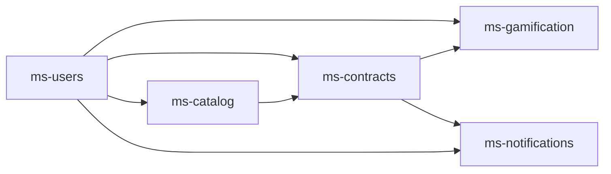
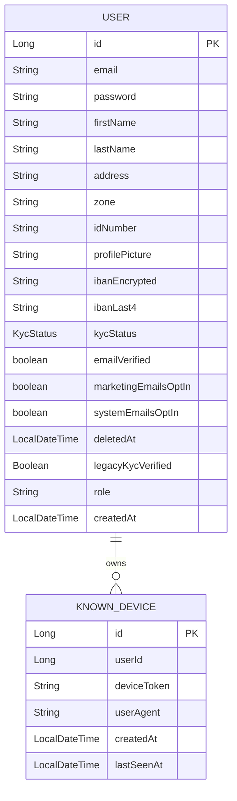
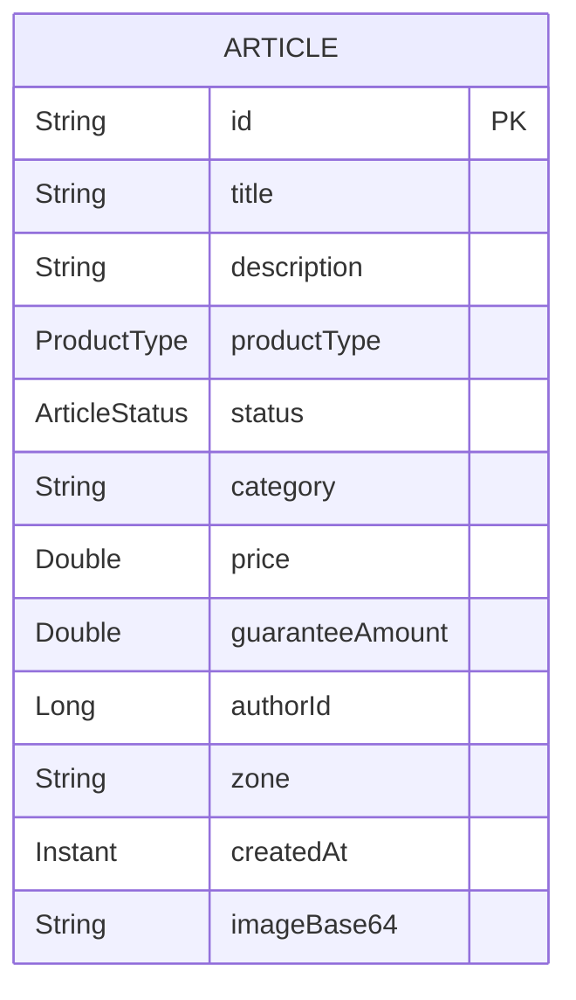
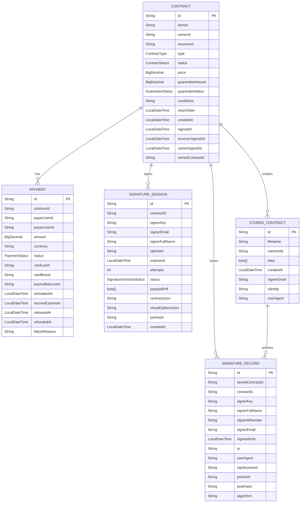
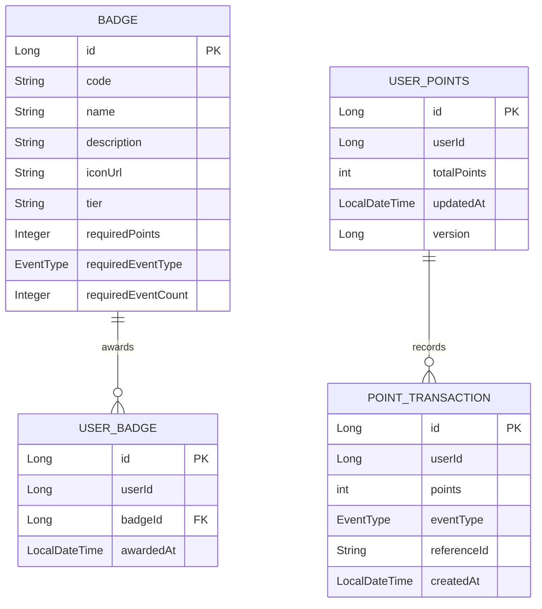
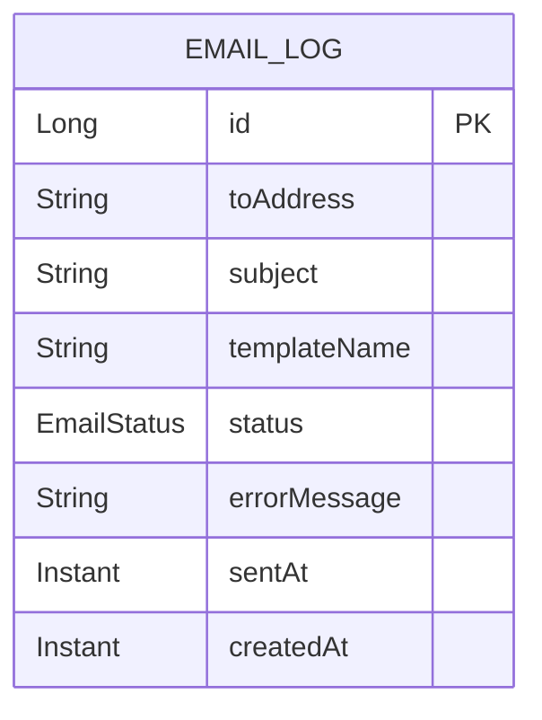
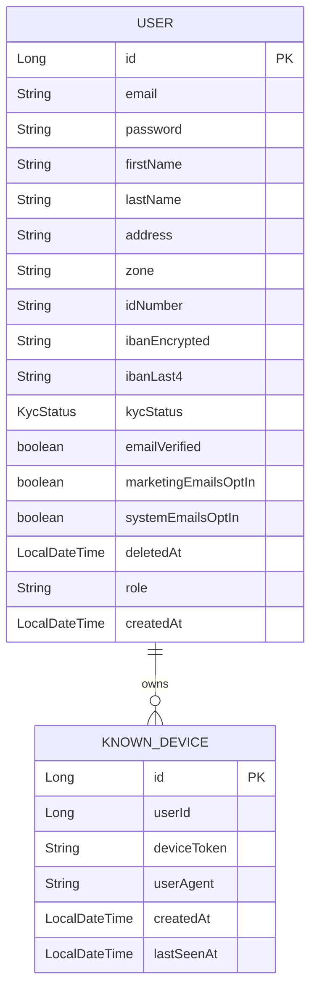

# Modelo de dominio del backend

Este documento resume las entidades principales del backend por microservicio y las relaciones que existen entre ellas. En este proyecto las relaciones entre microservicios son, en general, logicas y no JPA: se modelan con IDs y llamadas entre servicios.

## Vista global

## ms-users

Responsable de la identidad, el perfil publico y la informacion sensible del usuario.

### Entidades

### Relaciones

- `User` 1 -> N `KnownDevice` mediante `KnownDevice.userId`.
- `profilePicture` almacena solo el nombre de archivo del avatar y no una URL completa.
- `KycStatus` es un enum del ciclo de verificacion del usuario: `UNVERIFIED`, `PENDING_REVIEW`, `VERIFIED`, `REJECTED`.
- `legacyKycVerified` existe por compatibilidad con datos antiguos y se sincroniza con `kycStatus`.
- `zone` es una clasificacion cerrada reutilizada por otros microservicios, pero no existe una FK fisica con `ms-catalog` o `ms-contracts`.

## ms-catalog

Gestiona el catalogo de articulos publicado por los usuarios.

### Entidades

### Relaciones

- `Article.authorId` apunta de forma logica a `ms-users.User.id`.
- `Article.zone` se copia desde `ms-users` al publicar para evitar manipulacion desde el cliente.
- `Article.status` se usa para el ciclo de vida del articulo: `AVAILABLE`, `RESERVED`, `SOLD`, `DELETED`.
- `ProductType` clasifica el articulo: `DONATION`, `SYMBOLIC_RENTAL`, `SYMBOLIC_SALE`, `DEMAND`.
- `ms-contracts` actualiza el estado del articulo via endpoint interno cuando un contrato se crea o se firma.

## ms-contracts

Modela el contrato de negocio, los pagos simulados y el flujo de firma.

### Entidades

### Relaciones

- `Contract.itemId` apunta de forma logica a `ms-catalog.Article.id`.
- `Contract.ownerId`, `Contract.receiverId`, `Payment.payerUserId` y `Payment.payeeUserId` referencian usuarios de `ms-users` por ID, sin FK real.
- `Contract` 1 -> N `Payment` mediante `Payment.contractId`.
- `Contract` 1 -> N `SignatureSession` mediante `SignatureSession.contractId`.
- `Contract` 1 -> N `SignatureRecord` mediante `SignatureRecord.contractId`.
- `StoredContract` guarda el PDF generado y se enlaza con `Contract` por `storedContractId` y con auditoria mediante `SignatureRecord.storedContractId`.
- `SignatureSessionStatus` controla el flujo de OTP: `PENDING`, `USED`, `EXPIRED`, `LOCKED`.
- `Contract`, `Payment` y `StoredContract` forman el nucleo del flujo economico y documental del microservicio.

## ms-gamification

Gestiona puntos, insignias y el historial de transacciones de gamificacion.

### Entidades

### Relaciones

- `UserPoints` mantiene un unico registro por `userId`.
- `UserBadge.userId` apunta al usuario externo y `UserBadge.badge` referencia a `Badge` como relacion JPA interna.
- `PointTransaction.userId` guarda el historial de puntos por usuario.
- `EventType` define los eventos que otorgan puntos: `ITEM_DONATED`, `ITEM_RENTED_SOLIDARITY`, `CONTRACT_SIGNED`, `REVIEW_RECEIVED`, `PROFILE_COMPLETED`.
- Las vistas publicas de usuario en `ms-users` consumen este microservicio para mostrar resumen de puntos y badges.

## ms-notifications

Registra el resultado del envio de emails.

### Entidades

### Relaciones

- No hay relaciones JPA con otras entidades dentro de este microservicio.
- `EmailLog` funciona como bitacora tecnica del envio, con `EmailStatus` en `QUEUED`, `SENT` o `FAILED`.

## Resumen de relaciones entre microservicios

- `ms-users` es la fuente de verdad de identidad y perfil.
- `ms-catalog` publica articulos y depende de `ms-users` para obtener zona y autor.
- `ms-contracts` consume `ms-catalog` para el articulo y `ms-users` para firmantes, direcciones e IBAN en los PDFs y pagos.
- `ms-gamification` consume eventos de negocio de `ms-contracts` y otros hitos de usuario para calcular puntos y badges.
- `ms-notifications` almacena trazas del envio de emails; su informacion operativa se alimenta desde los casos de uso del resto de servicios.
# Modelo de dominio del backend

Este documento resume las entidades principales del backend por microservicio y las relaciones que existen entre ellas. En este proyecto las relaciones entre microservicios son, en general, logicas y no JPA: se modelan con IDs y llamadas entre servicios.

## Vista global

## ms-users

Responsable de la identidad, el perfil publico y la informacion sensible del usuario.

### Entidades

### Relaciones

- `User` 1 -> N `KnownDevice` mediante `KnownDevice.userId`.
- `KycStatus` es un enum del ciclo de verificacion del usuario: `UNVERIFIED`, `PENDING_REVIEW`, `VERIFIED`, `REJECTED`.
- `zone` es una clasificacion cerrada reutilizada por otros microservicios, pero no existe una FK fisica con `ms-catalog` o `ms-contracts`.

## ms-catalog

Gestiona el catalogo de articulos publicado por los usuarios.

### Entidades

### Relaciones

- `Article.authorId` apunta de forma logica a `ms-users.User.id`.
- `Article.zone` se copia desde `ms-users` al publicar para evitar manipulacion desde el cliente.
- `Article.status` se usa para el ciclo de vida del articulo: `AVAILABLE`, `RESERVED`, `SOLD`, `DELETED`.
- `ProductType` clasifica el articulo: `DONATION`, `SYMBOLIC_RENTAL`, `SYMBOLIC_SALE`, `DEMAND`.
- `ms-contracts` actualiza el estado del articulo via endpoint interno cuando un contrato se crea o se firma.

## ms-contracts

Modela el contrato de negocio, los pagos simulados y el flujo de firma.

### Entidades

### Relaciones

- `Contract.itemId` apunta de forma logica a `ms-catalog.Article.id`.
- `Contract.ownerId`, `Contract.receiverId`, `Payment.payerUserId` y `Payment.payeeUserId` referencian usuarios de `ms-users` por ID, sin FK real.
- `Contract` 1 -> N `Payment` mediante `Payment.contractId`.
- `Contract` 1 -> N `SignatureSession` mediante `SignatureSession.contractId`.
- `Contract` 1 -> N `SignatureRecord` mediante `SignatureRecord.contractId`.
- `StoredContract` guarda el PDF generado y se enlaza con `Contract` por `storedContractId` y con auditoria mediante `SignatureRecord.storedContractId`.
- `SignatureSessionStatus` controla el flujo de OTP: `PENDING`, `USED`, `EXPIRED`, `LOCKED`.
- `Contract`, `Payment` y `StoredContract` forman el nucleo del flujo economico y documental del microservicio.

## ms-gamification

Gestiona puntos, insignias y el historial de transacciones de gamificacion.

### Entidades

### Relaciones

- `UserPoints` mantiene un unico registro por `userId`.
- `UserBadge.userId` apunta al usuario externo y `UserBadge.badge` referencia a `Badge` como relacion JPA interna.
- `PointTransaction.userId` guarda el historial de puntos por usuario.
- `EventType` define los eventos que otorgan puntos: `ITEM_DONATED`, `ITEM_RENTED_SOLIDARITY`, `CONTRACT_SIGNED`, `REVIEW_RECEIVED`, `PROFILE_COMPLETED`.
- Las vistas publicas de usuario en `ms-users` consumen este microservicio para mostrar resumen de puntos y badges.

## ms-notifications

Registra el resultado del envio de emails.

### Entidades

### Relaciones

- No hay relaciones JPA con otras entidades dentro de este microservicio.
- `EmailLog` funciona como bitacora tecnica del envio, con `EmailStatus` en `QUEUED`, `SENT` o `FAILED`.

## Resumen de relaciones entre microservicios

- `ms-users` es la fuente de verdad de identidad y perfil.
- `ms-catalog` publica articulos y depende de `ms-users` para obtener zona y autor.
- `ms-contracts` consume `ms-catalog` para el articulo y `ms-users` para firmantes, direcciones e IBAN en los PDFs y pagos.
- `ms-gamification` consume eventos de negocio de `ms-contracts` y otros hitos de usuario para calcular puntos y badges.
- `ms-notifications` almacena trazas del envio de emails; su informacion operativa se alimenta desde los casos de uso del resto de servicios.
